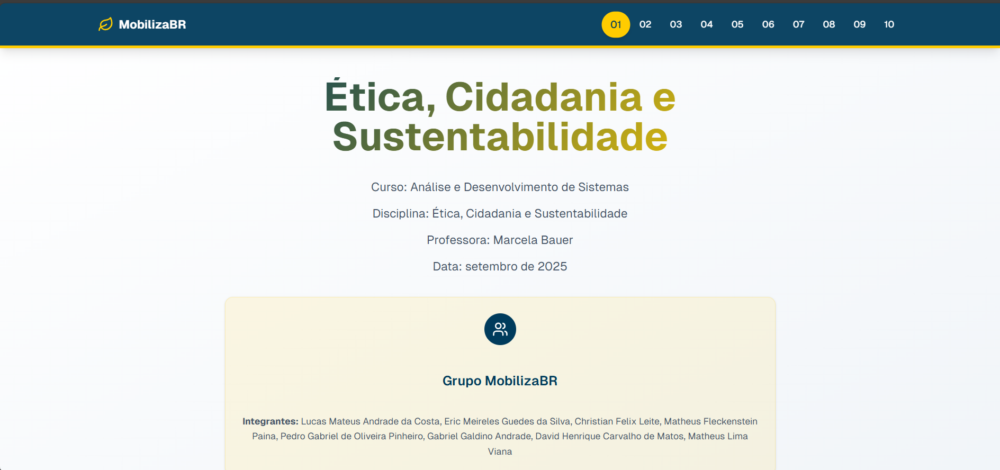

<!-- PORTFOLIO-FEATURED 
 title: Ética, Cidadania e Sustentabilidade 
 description: Site desenvolvido para a disciplina de Ética, Cidadania e Sustentabilidade, apresentando o trabalho do grupo MobilizaBR sobre temas relacionados à ética, cidadania e sustentabilidade em comunidades. 
 technologies: Next.js, React, TypeScript, Tailwind CSS, Radix UI 
 demo: https://mobilizabr-etica-cidadania-sustenta.vercel.app/ 
 highlight: true 
<<<<<<< HEAD
 image: foto.png
=======
 image: foto.png 
>>>>>>> 3d542ac03eb7973d5959dccb3043e14c49acdff3
 --> 

<p align="center"> 
   
</p>

# Ética, Cidadania e Sustentabilidade - MobilizaBR

## 📋 Sobre o Projeto

Este projeto é um site desenvolvido para a disciplina de Ética, Cidadania e Sustentabilidade do curso de Análise e Desenvolvimento de Sistemas. O site apresenta o trabalho do grupo MobilizaBR, abordando temas relacionados à ética, cidadania e sustentabilidade em comunidades.

## 👥 Equipe MobilizaBR

- Lucas Mateus Andrade da Costa
- Eric Meireles Guedes da Silva
- Christian Felix Leite
- Matheus Fleckenstein Paina
- Pedro Gabriel de Oliveira Pinheiro
- Gabriel Galdino Andrade
- David Henrique Carvalho de Matos
- Matheus Lima Viana

## 🚀 Tecnologias Utilizadas

- [Next.js](https://nextjs.org/) - Framework React para desenvolvimento web
- [React](https://reactjs.org/) - Biblioteca JavaScript para construção de interfaces
- [Tailwind CSS](https://tailwindcss.com/) - Framework CSS para estilização
- [Radix UI](https://www.radix-ui.com/) - Biblioteca de componentes acessíveis
- [Lucide React](https://lucide.dev/) - Biblioteca de ícones
- [TypeScript](https://www.typescriptlang.org/) - Superset tipado de JavaScript

## 🏗️ Estrutura do Projeto

O site é composto por várias seções que abordam diferentes aspectos do trabalho:

- **Hero Section**: Apresentação inicial do projeto
- **Introduction Section**: Introdução ao tema
- **Ethics Section**: Abordagem sobre ética
- **Extension Section**: Informações sobre extensão universitária
- **Community Concept Section**: Conceito de comunidade
- **Community Choice Section**: Escolha da comunidade
- **Community Characterization Section**: Caracterização da comunidade escolhida
- **Proposal Section**: Proposta de atividades
- **Resources Section**: Recursos necessários
- **Conclusion Section**: Conclusão do trabalho

## 🛠️ Como Executar

1. Clone o repositório:
   ```bash
   git clone [URL_DO_REPOSITÓRIO]
   ```

2. Instale as dependências:
   ```bash
   npm install
   # ou
   yarn install
   # ou
   pnpm install
   ```

3. Execute o servidor de desenvolvimento:
   ```bash
   npm run dev
   # ou
   yarn dev
   # ou
   pnpm dev
   ```

4. Abra [http://localhost:3000](http://localhost:3000) no seu navegador para ver o resultado.

## 📝 Licença

Este projeto foi desenvolvido para fins acadêmicos como parte da disciplina de Ética, Cidadania e Sustentabilidade.

---

Desenvolvido pelo Grupo MobilizaBR © 2025
